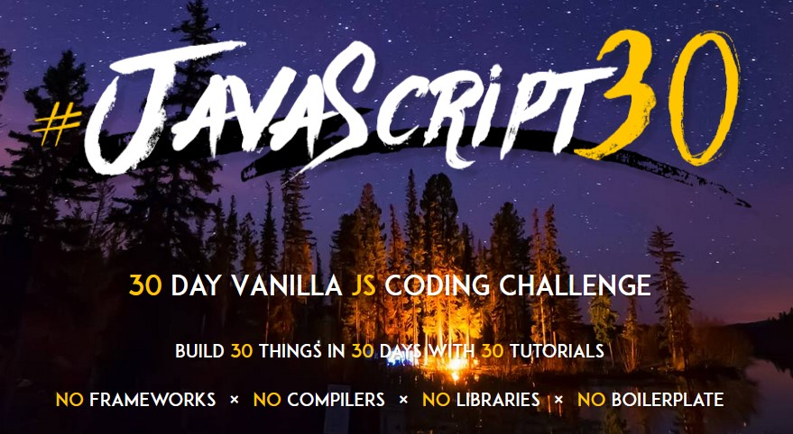

# JavaScript30

[JavaScript30](https://javascript30.com/) is a free course created by [Wes Bos](https://github.com/wesbos) where you can practive Vanila JS Coding Challenges in 30 days with no frameworks, no compilers, no libraries, and no boilerplate

### Challenge list
| No | Title | REPOSITORY | DEMO |
| :---: | ---- | :-------: | :-------: |
| 01 | JavaScript Drum Kit | [README](https://github.com/hmothershed/JavaScript30/blob/main/01-Drum-Kit/README.md) | [DEMO](https://hmothershed.github.io/JavaScript30/01-Drum-Kit/) |
| 02 | CSS + JS Clock | [README](https://github.com/hmothershed/JavaScript30/blob/main/02-CSS-and-JS-Clock/README.md) | [DEMO](https://hmothershed.github.io/JavaScript30/02-CSS-and-JS-Clock/) |
| 03 | Playing with CSS Variables and JS | [README](https://github.com/hmothershed/JavaScript30/blob/main/03-CSS-Variables/README.md) | [DEMO](https://hmothershed.github.io/JavaScript30/03-CSS-Variables/) |
| 04 | Array Cardio Day 1 | [README](https://github.com/hmothershed/JavaScript30/blob/main/04-Array-Cardio-Day-1/README.md) | [DEMO](https://hmothershed.github.io/JavaScript30/04-Array-Cardio-Day-1/) |
| 05 | Flex Panels Image Gallery | [README](https://github.com/hmothershed/JavaScript30/blob/main/05-Flex-Panel-Gallery/README.md) | [DEMO](https://hmothershed.github.io/JavaScript30/05-Flex-Panel-Gallery/) |
| 06 | Ajax Type Ahead | [README](https://github.com/hmothershed/JavaScript30/blob/main/06-AJAX-Type-Ahead/README.md) | [DEMO](https://hmothershed.github.io/JavaScript30/06-AJAX-Type-Ahead/) |
| 07 | Array Cardio Day 2 | [README](https://github.com/hmothershed/JavaScript30/blob/main/07-Array-Cardio-Day-2/README.md) | [DEMO](https://hmothershed.github.io/JavaScript30/07-Array-Cardio-Day-2/) |
| 08 | Fun with HTML5 Canvas | [README](https://github.com/hmothershed/JavaScript30/blob/main/08-HTML5-Canvas/README.md) | [DEMO](https://hmothershed.github.io/JavaScript30/08-HTML5-Canvas/) |
| 09 | Dev Tools Domination | [README](https://github.com/hmothershed/JavaScript30/blob/main/09-Dev-Tools-Domination/README.md) | [DEMO](https://hmothershed.github.io/JavaScript30/09-Dev-Tools-Domination/) |
| 10 | Hold Shift to Check Multiple Checkboxes | [README](https://github.com/hmothershed/JavaScript30/blob/main/10-Checkboxes/README.md) | [DEMO](https://hmothershed.github.io/JavaScript30/10-Checkboxes/) |
| 11 | Custom HTML5 Video Player | [README](https://github.com/hmothershed/JavaScript30/blob/main/11-Custom-Video-Player/README.md) | [DEMO](https://hmothershed.github.io/JavaScript30/11-Custom-Video-Player/) |
| 12 | Key Sequence Detection (KONAMI CODE) | [README](https://github.com/hmothershed/JavaScript30/blob/main/12-Key-Sequence-Detection/README.md) | [DEMO](https://hmothershed.github.io/JavaScript30/12-Key-Sequence-Detection/) |
| 13 | Slide In on Scroll | [README]() | [DEMO]() |
| 14 | Object and Arrays - Reference VS Copy | [README]() | [DEMO]() |
| 15 | LocalStorage and Event Delegation | [README]() | [DEMO]() |
| 16 | CSS Text Shadow Mouse Move Effect | [README]() | [DEMO]() |
| 17 | Sorting Band Names Without Articles | [README]() | [DEMO]() |
| 18 | Tally String Times with Reduce | [README]() | [DEMO]() |
| 19 | Unreal Webcam Fun | [README]() | [DEMO]() |
| 20 | Native Speech Recognition | [README]() | [DEMO]() |
| 21 | Geolocation Based Speedometer and Compass | [README]() | [DEMO]() |
| 22 | Follow Along Links | [README]() | [DEMO]() |
| 23 | Speech Synthesis | [README]() | [DEMO]() |
| 24 | Sticky Nav | [README]() | [DEMO]() |
| 25 | Event Capture, Propagation, Bubbling and Once | [README]() | [DEMO]() |
| 26 | Strip Follow Along Dropdown | [README]() | [DEMO]() |
| 27 | Click and Drag to Scroll | [README]() | [DEMO]() |
| 28 | Video Speed Controller UI | [README]() | [DEMO]() |
| 29 | Countdown Clock | [README]() | [DEMO]() |
| 30 | Whack A Mole Game | [README]() | [DEMO]() |
